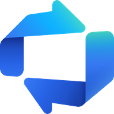
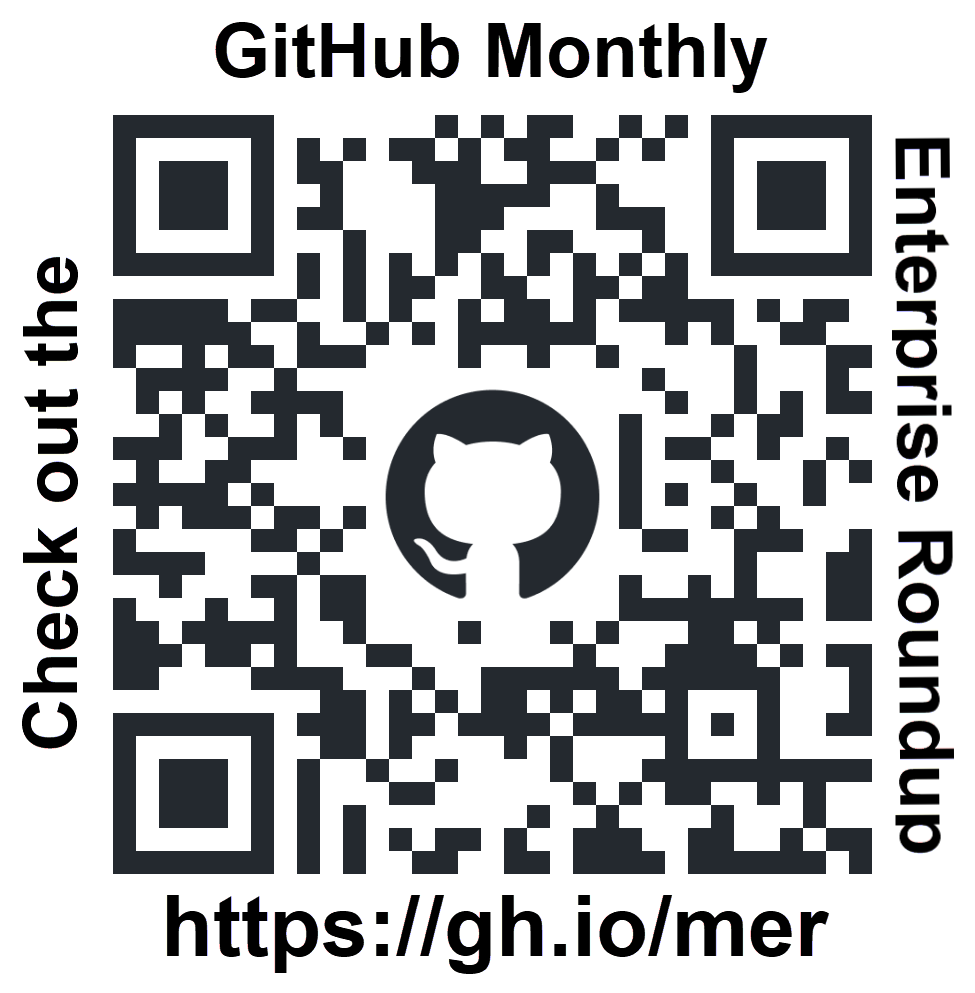
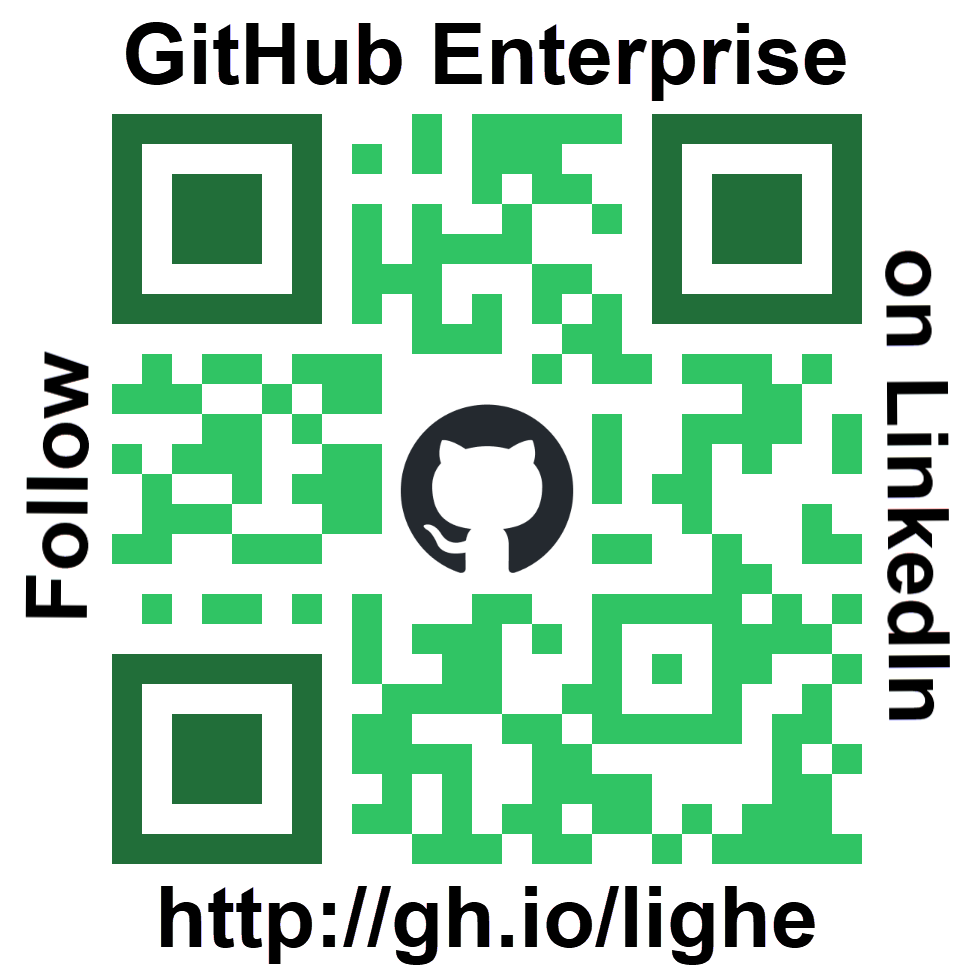

#  Tailspin Shelter - A Zava supported non-profit organization 

|  |  |
|---------|---------|

This repository is used to demonstrate the full capabilities of the **GitHub platform**, including integrations with **Azure Boards** and **Azure Pipelines**. 

The code is a website for a fictional dog shelter, with a [Flask](https://flask.palletsprojects.com/en/stable/) backend using [SQLAlchemy](https://www.sqlalchemy.org/) and an [Astro](https://astro.build/) frontend using [Tailwind CSS](https://tailwindcss.com/).

## Getting started

> **[Get started learning about development with GitHub!](./content/README.md)**
> 
> **[New to GitHub Copilot? Check out our list of GitHub Copilot resources!](./content/GitHub-Copilot-Resources.md)**

## License 

This project is licensed under the terms of the MIT open source license. Please refer to the [LICENSE](./LICENSE) for the full terms.

## Maintainers 

You can find the list of maintainers in [CODEOWNERS](./.github/CODEOWNERS).

## Support

This project is provided as-is, and may be updated over time. If you have questions, please create a work item in the [Tailspin-Shelter](https://dev.azure.com/DevRelLabs/Tailspin-Shelter/_dashboards/dashboard/1cdebbdb-2ee5-4476-ae9c-cf0cf444f9bb) team project in **Azure DevOps**. (**NOTE**: Access to the Azure DevOps team project is limited. If you do not have access, please [open an issue in this repo](https://github.com/devrellabs/tailspin-shelter/issues).)

## Azure Boards Status

## GitHub Actions Status 

**🔲 Server Tests:** 
Badge temporarily removed until the Tailspin-Shelter workflow is available.

## Azure Pipelines Status 
🔲 Azure Pipelines badge not currently configured.

## Environments:
 - **Dev**: (**To be configured**)
 - **QA**: (**To be configured**)
 - **🔲 NEEDS UPDATING:** **Production**: [Web Site](https://client.braveforest-9b03311d.westus.azurecontainerapps.io/)

## Key Azure Resources
- [Resource Group](https://portal.azure.com/#@daveburnisonyahoo.onmicrosoft.com/resource/subscriptions/9078e9ae-b0c7-4eb8-8054-e9bf5e1875ad/resourceGroups/DevRelLabs-Tailspin-Shelter-Prod/overview)
- **🔲 NEEDS UPDATING:** [Dashboard](https://portal.azure.com/#@daveburnisonyahoo.onmicrosoft.com/dashboard/arm/subscriptions/9078e9ae-b0c7-4eb8-8054-e9bf5e1875ad/resourcegroups/rg-production/providers/microsoft.portal/dashboards/dash-wgry4yau64yb6)

## Integrations 

|  |
|--------------|
| Azure DevOps |

# Check out the GitHub Monthly Enterprise Roundup (MER)
GitHub is shipping new features, product updates, and best practices faster than ever. To help you stay ahead, the GitHub Enterprise Advocacy team curates a monthly roundup — bringing you a concise, enterprise-focused summary of the most important updates you might have missed.

In these posts, you’ll find a carefully selected list of key innovations, expert insights, and must-know resources—guided by feedback from GitHub’s largest customers—to help your team innovate faster, boost productivity and enhance security.

Share with your teams and stakeholders so they can also get the most out of their GitHub experience. asdasd

| GitHub Monthly Enterprise Roundup (MER) |          | Follow **GitHub Enterprise** on **LinkedIn** to be notified of each new post |
|---------|---------|---------|
|  |          |  |

